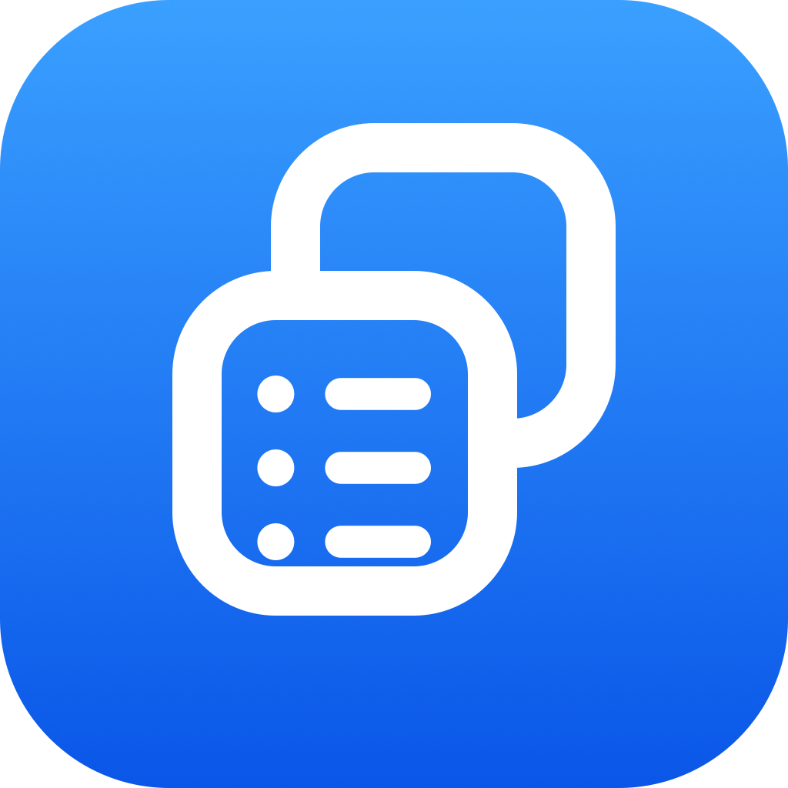

<div align="center">
  
  <h1>ClipMenu 2</h1>
  <p><strong>Clipboard history and snippets in your menu bar</strong></p>
</div>

ClipMenu 2 is a clipboard-history manager for macOS, rewritten in Swift 6. It runs
as a menu-bar agent with no Dock icon: press ⌘⇧V to pop the menu at the cursor,
pick a clip, and it is pasted into the app you were working in. Snippets,
JavaScript text actions, and folder-based backup of your settings come with it.

[](https://github.com/teddychan/clipmenu-2/releases/latest)


[](https://www.dragonapp.com/clipmenu-2/)
[](LICENSE)

## Contents

- [Requirements](#requirements)
- [Install](#install)
- [Features](#features)
- [Actions and snippets](#actions-and-snippets)
- [Troubleshooting](#troubleshooting)
- [Building from source](#building-from-source)
- [Tests](#tests)
- [Contributing](#contributing)
- [Credits](#credits)
- [License](#license)

## Requirements

- macOS 26 (Tahoe) or later.
- Apple Silicon — the app ships a single arm64 build.

## Install

### Homebrew

```bash
brew install --cask teddychan/tap/clipmenu-2
```

Upgrade later with `brew upgrade --cask clipmenu-2`.

### Mac App Store

ClipMenu 2 is also on the
[Mac App Store](https://apps.apple.com/us/app/clipmenu-2/id6775685878?mt=12), free.
That build is sandboxed and updates through the App Store instead of Sparkle. Because
the sandbox forbids pasting into other apps, it copies the clip you pick and you press
⌘V yourself; everything else matches the direct download.

### Manual

Download `ClipMenu-2-vX.Y.Z.zip` from the
[latest release](https://github.com/teddychan/clipmenu-2/releases/latest), unzip it,
and move `ClipMenu 2.app` into `/Applications`. These builds are Developer
ID-signed and notarized, and update themselves via Sparkle.

### Uninstall

Quit ClipMenu 2 first. The Settings window has an **Uninstall** pane that removes the
app, its login item, preferences, caches, and support files for you, with an optional
toggle for your clipboard history and snippets.

To do it by hand, quit the app, then:

```bash
brew uninstall --zap --cask clipmenu-2      # if you installed with Homebrew
rm -rf ~/Library/Preferences/com.dragonapp.clipmenu-2.plist \
       ~/Library/Caches/com.dragonapp.clipmenu-2 \
       ~/Library/HTTPStorages/com.dragonapp.clipmenu-2 \
       "$HOME/Library/Application Support/ClipMenu"
```

`Application Support/ClipMenu` holds the clipboard-history and snippet stores,
`actions.plist`, and your own action scripts — delete it only if you want that data
gone. The App Store build is sandboxed, so its files live in
`~/Library/Containers/com.dragonapp.clipmenu-2` instead.

## Features

> [!NOTE]
> ClipMenu 2 is a modern Swift 6 rebuild based on the original
> [ClipMenu](https://github.com/naotaka/ClipMenu) by Naotaka Morimoto, used under the
> MIT License.

- **Clipboard history at the cursor** — ⌘⇧V pops the main menu where your pointer is,
  ⌃⌘V the history-only menu, ⌘⇧B the snippets menu; all three are rebindable in
  Settings ▸ Shortcuts.
- **Search as you type** — the history menu (⌃⌘V) opens with a focused search field
  and filters clips on every keystroke.
- **Seven clipboard types** — plain text, RTF, RTFD, PDF, filenames, URLs, and TIFF
  images, each individually switchable in Settings ▸ Type.
- **Menu you can shape** — inline versus folded item counts, item numbering with
  numeric key equivalents, type labels, tooltips, font size, and image thumbnails.
- **Text snippets in folders** — stored separately from history and shown above,
  below, or grouped under the clipboard list.
- **JavaScript actions** — transform a clip in place with bundled or your own scripts;
  see [Actions and snippets](#actions-and-snippets).
- **Excluded apps** — name applications whose clipboard contents ClipMenu 2 should
  never record.
- **Folder-based backup and sync** — point Settings ▸ Sync & Backup at a folder to
  back up snippets and settings; put that folder in Dropbox, iCloud Drive, or Google
  Drive to carry them between Macs. No account, no CloudKit.
- **Seven languages** — English, Simplified and Traditional Chinese, Japanese, Korean,
  Spanish, and French, switchable without restarting.
- **Launch at login** and a status-bar item you can hide.

## Actions and snippets

### Actions

Actions are text transforms that run on the item you clicked. Control-click or
right-click a clip or snippet in the menu to pop the Actions menu; the result is
copied and pasted for you. Settings ▸ Action decides which modifier does what —
Shift-, Option-, and Command-click do nothing by default — and can invoke a lone
action immediately instead of showing a menu.

Bundled actions live in `app/Sources/ClipMenu/Resources/script/action`:

| Group | What it does |
|---|---|
| Case | UPPERCASE, lowercase, Capitalize, Title Case |
| Trim | Trim, LTrim, RTrim, and Collapse Spaces |
| HTML | escape and unescape entities, strip tags, encode and decode URI components, character↔decimal, Markdown to HTML, surround with a tag you type |
| Crypt | Base64 encode and decode, MD5, SHA-1 |
| Japanese | hiragana↔katakana, and zenkaku↔hankaku for alphanumerics and katakana |
| Surround with | wrap the text in quotes, brackets, or braces — an ASCII set and a Japanese set (「」, 【】, （）, and the rest) |
| Reverse | reverse the characters |

Three built-in actions are not scripts: **Paste as Plain Text**, **Paste as File
Path**, and **Remove** (delete the clip from history).

Scripts run in JavaScriptCore with the clip's text bound to `clipText`; a script
returns the replacement string, can `ClipMenu.require()` a bundled library, and can
`prompt()` you for input. Add your own by dropping `.js` files into
`~/Library/Application Support/ClipMenu/script/action/` — that tree is searched before
the bundled one, so a same-named file overrides a built-in. Settings ▸ Action lists
Built-in, Script, and User Script actions so you can pick which appear in the menu.

### Snippets

Snippets are reusable text you keep in folders. Open **Edit Snippets…** from the menu
to add, rename, reorder, and delete them, or to import and export the whole set as
XML; each folder becomes a submenu, ordered as you arranged it. Settings ▸ Menu
controls where snippets sit relative to the clipboard history and whether every folder
is grouped under a single **Snippets** item. On first launch, a legacy `Snippets.xml`
in `~/Library/Application Support/ClipMenu/` is imported if your snippet store is
still empty.

## Troubleshooting

### Pasting does nothing

Pasting into the frontmost app needs Accessibility permission. Grant ClipMenu 2 under
System Settings ▸ Privacy & Security ▸ Accessibility. The Mac App Store build cannot
use Accessibility at all — its sandbox forbids it — so there the clip is copied and
you press ⌘V.

### The permission grant resets after every build

That is expected of a locally built app that is ad-hoc signed: macOS treats each build
as a new application. Create a stable self-signed "ClipMenu Dev" code-signing
certificate (Keychain Access ▸ Certificate Assistant) and `scripts/run.sh` will sign
with it, so the grant survives rebuilds.

## Building from source

You need macOS 26 or later on Apple Silicon and a Swift 6 toolchain (Xcode 26+ or the
matching Command Line Tools).

### Build and run

```bash
cd app
swift build
./scripts/run.sh        # assembles a .app bundle and launches it
```

Use `scripts/run.sh` rather than `swift run`: it builds, assembles
`.build/ClipMenu 2.app` (an `LSUIElement` agent), code-signs it, and launches it. The
status-bar item and agent behavior only work from inside a `.app` bundle — `swift run`
launches a bare executable.

### Project layout

- `app/` — the Swift app: `Sources/`, `Tests/`, bundled `Resources/`, and `scripts/`.

### Releasing

Releases are automated in GitHub Actions. Pushing a `vX.Y.Z` tag builds, signs
(Developer ID), notarizes, and publishes the GitHub Release, the Sparkle appcast, and
the Homebrew cask; pushing a `mas-vX.Y.Z` tag builds and uploads the Mac App Store
package. See [`.github/workflows/release.yml`](.github/workflows/release.yml) and
[`.github/workflows/release-mas.yml`](.github/workflows/release-mas.yml).

## Tests

The suite lives in `app/Tests/ClipMenuTests` and runs on Swift Testing, no simulator
or granted permissions required. It covers clipboard capture and privacy filtering, the
history and snippet stores with their migrations, JavaScript and built-in actions, menu
building and search, hotkey rebinding, the Settings panes, and folder backup and
restore. CI runs the whole suite on every pull request via
[`.github/workflows/tests.yml`](.github/workflows/tests.yml).

[](https://github.com/teddychan/clipmenu-2/actions/workflows/tests.yml)

```bash
cd app && swift test
```

| Metric | Value |
|---|---|
| Test cases | 374 passing |
| Line coverage | 74.2% of `Sources/ClipMenu` |
| Measured on | v2.18.1 (`154fc6e`), Swift 6.3.3 |

## Contributing

Bug reports and feature requests are welcome on the
[issues page](https://github.com/teddychan/clipmenu-2/issues). For pull requests, keep
changes focused, run `cd app && swift test` before you push, and record notable
changes in [CHANGELOG.md](CHANGELOG.md) (developer-facing notes; the user-facing
release notes live in `app/Sources/ClipMenu/WhatsNewConfig.swift`).

## Credits

Based on the original [ClipMenu](https://github.com/naotaka/ClipMenu) by Naotaka
Morimoto, used under the MIT License.

My first clipboard manager was
[CLCL](https://nakka.com/soft/clcl/index_eng.html):


## License

MIT — see [LICENSE](LICENSE).
